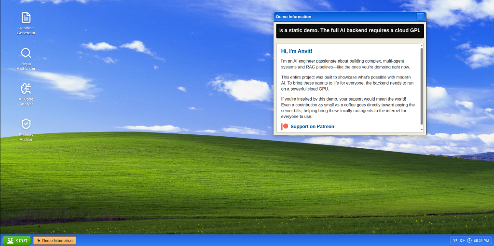
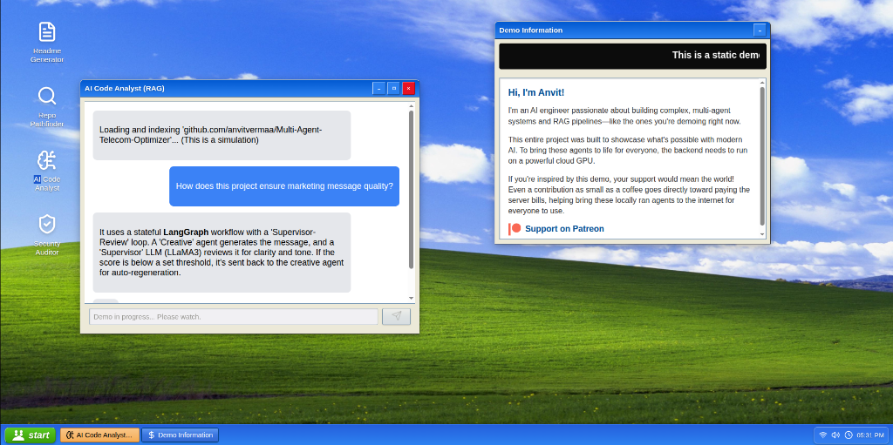

# 🤖 GitHub Repo Analyst AI

> *A fully autonomous conversational AI tool for codebase analysis and security audits, seamlessly integrated into a nostalgic Windows XP simulation.*



## 🌟 Overview
**GitHub Repo Analyst AI** bridges the gap between deep technical code analysis and an engaging, interactive user experience. Designed to run locally or in the cloud, this platform gives you an interactive Windows XP-themed desktop simulation where you can chat with your codebase.

Behind the nostalgic interface is a cutting-edge orchestration layer powered by **LangGraph**, **LLaMA 3**, and **ChromaDB**. It doesn't just answer questions; it actively reads, indexes, and audits your repositories.

## ✨ Key Features

### 1. Conversational Codebase Analysis (RAG)
By leveraging a Retrieval-Augmented Generation (RAG) pipeline built on top of ChromaDB, the AI ingests your entire repository. You can ask complex architectural questions, find specific logic, or have the AI explain undocumented legacy code in plain English.



### 2. Autonomous Security Auditor
The platform features an autonomous security agent that executes a rigorous **three-stage security audit**:
1. **SAST (Static Application Security Testing):** Scans the source code for hardcoded secrets, SQL injection vulnerabilities, and logic flaws.
2. **Dependency Analysis:** Reviews your `requirements.txt` or `package.json` against known CVE databases.
3. **Architectural Review:** Suggests structural improvements based on modern security best practices.

### 3. Flawless Windows XP Simulation
The frontend isn't just a skin; it's a fully interactive desktop environment. Built entirely with React and Framer Motion, it features draggable windows, functional start menus, taskbars, and custom icons.

---

## 💻 Tech Stack Architecture

**🧠 AI & Orchestration Layer:**
- **LangGraph:** Stateful, multi-actor orchestration for complex agent workflows.
- **LangChain:** Core framework for LLM interaction.
- **LLaMA 3 (via Ollama):** Local, privacy-preserving LLM inference.
- **ChromaDB:** High-performance vector database for semantic code search.

**⚙️ Backend Services:**
- **Python & FastAPI:** High-performance asynchronous API endpoints.
- **Celery & Redis:** Background task queues for heavy repository indexing and asynchronous agent execution.
- **SQLAlchemy:** Relational database management.

**🖥️ Frontend Interface:**
- **React 19 & Vite:** Lightning-fast frontend tooling and component rendering.
- **Framer Motion:** Smooth window dragging, animations, and transitions.
- **Tailwind CSS:** Utility-first styling for pixel-perfect XP recreation.

---

## 🚀 Getting Started

Follow these instructions to set up the project locally.

### Prerequisites
- **Python 3.10+**
- **Node.js 18+**
- **Redis Server** (required for Celery)
- **Ollama** (with the `llama3` model pulled: `ollama run llama3`)

### Backend Installation

1. **Navigate to the backend folder:**
   ```bash
   cd backend
   ```
2. **Create a virtual environment:**
   ```bash
   python -m venv venv
   source venv/bin/activate  # Windows: venv\Scripts\activate
   ```
3. **Install dependencies:**
   ```bash
   pip install -r requirements.txt
   ```
4. **Environment Configuration:**
   Create a `.env` file in the `backend` directory and configure your Redis and Database URLs if they differ from the defaults.
5. **Start the infrastructure:**
   Ensure Redis is running locally. Start the Celery worker:
   ```bash
   celery -A app.celery_worker worker --loglevel=info
   ```
6. **Run the FastAPI server:**
   ```bash
   uvicorn run:app --host 0.0.0.0 --port 8000 --reload
   ```

### Frontend Installation

1. **Navigate to the frontend folder:**
   ```bash
   cd frontend
   ```
2. **Install dependencies:**
   ```bash
   npm install
   ```
3. **Start the development server:**
   ```bash
   npm run dev
   ```
4. Open your browser to `http://localhost:5173` and enjoy the XP experience!

---

## 🤝 Contributing
Contributions are always welcome! Whether it's adding new "XP apps", improving the RAG pipeline's chunking strategy, or fixing bugs:
1. Fork the Project
2. Create your Feature Branch (`git checkout -b feature/AmazingFeature`)
3. Commit your Changes (`git commit -m 'Add some AmazingFeature'`)
4. Push to the Branch (`git push origin feature/AmazingFeature`)
5. Open a Pull Request

## 📝 License
This project is licensed under the MIT License.
